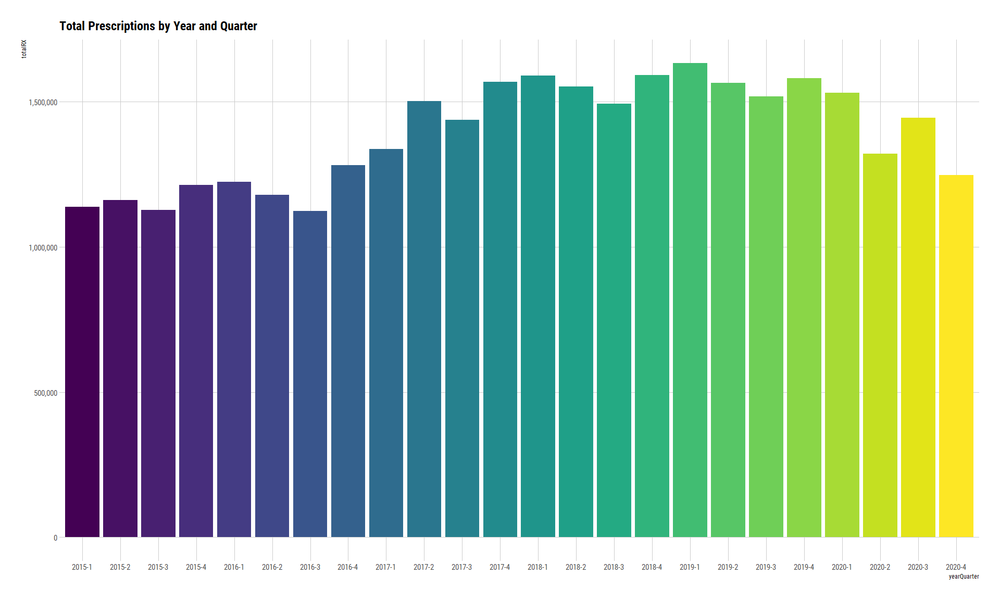
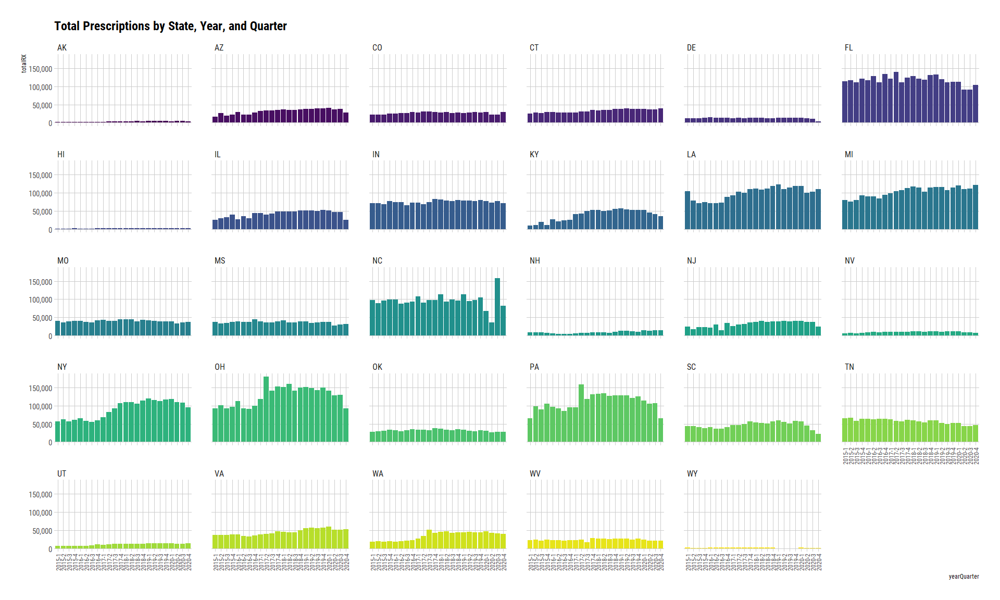
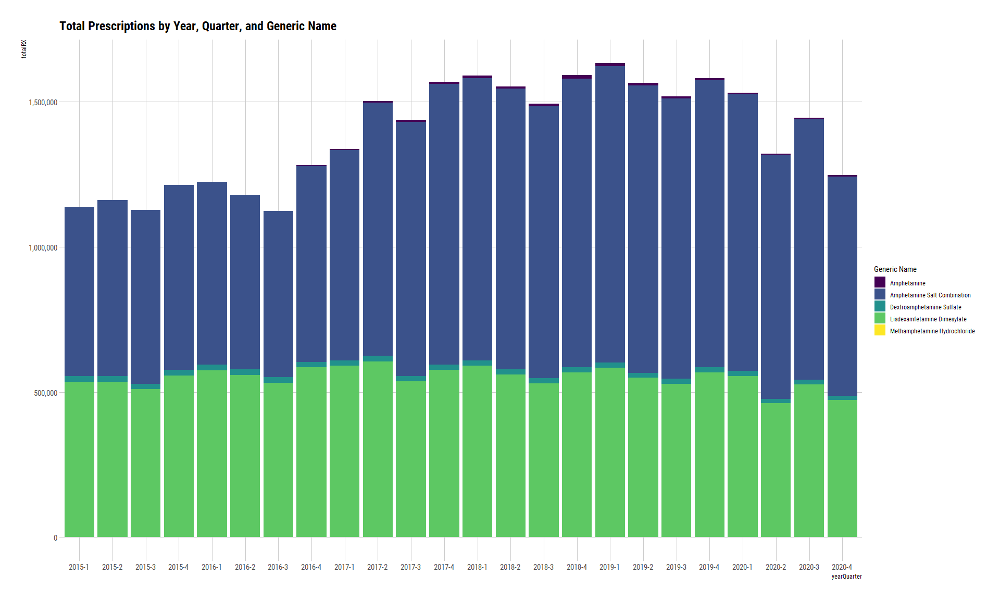
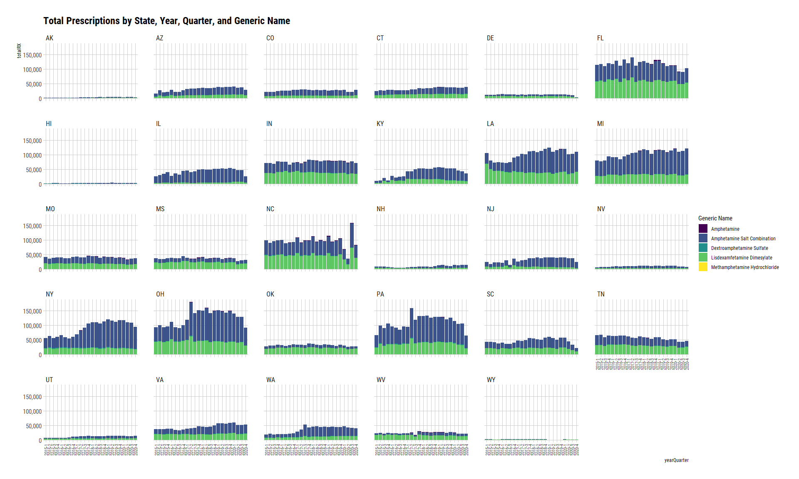
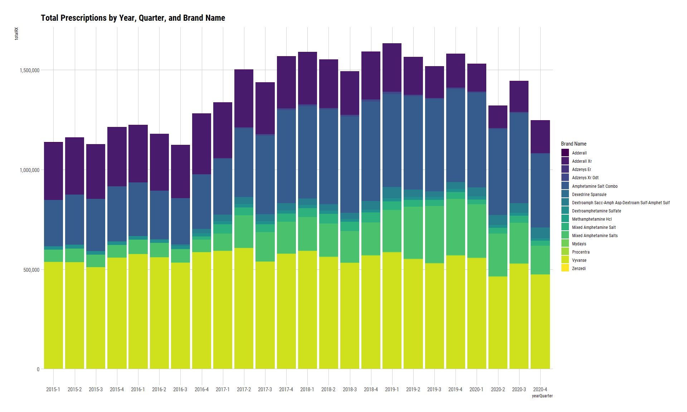
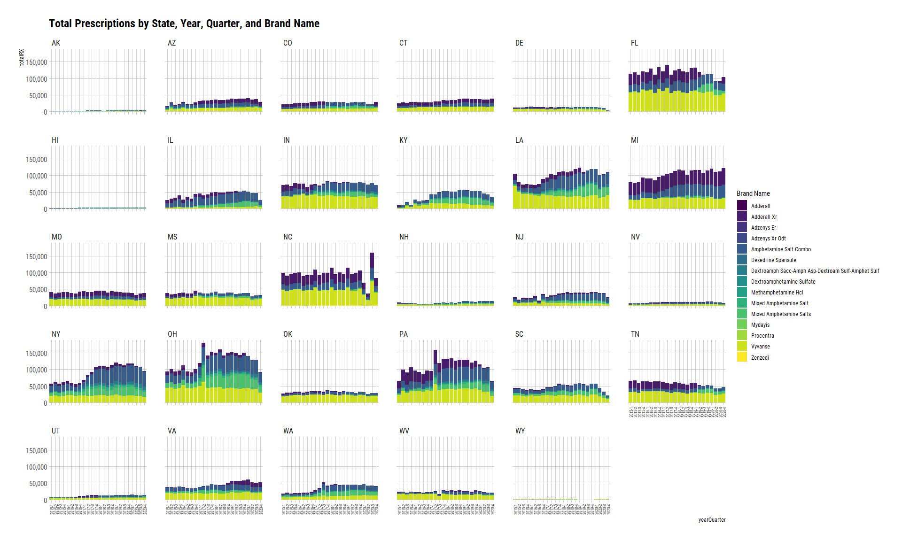

SDUD Stimulants 2015 - 2010
================
Michael Quinn Maguire, MS
6/9/2021

``` r
library(data.table)
library(tidyverse)
library(hrbrthemes)
```

### Read in the dataset.

### Coerce NDC to character. Otherwise it is read as integer.

``` r
base <-
  fread(
    file_location,
    colClasses = c("proper_ndc" = "character")
  )

base
```

    ##            proper_ndc utilization.type year quarter state suppression numberrx
    ##        1: 00002010102             FFSU 2020       2    TN           T        0
    ##        2: 00002010102             FFSU 2020       3    TN           T        0
    ##        3: 00002010102             MCOU 2020       4    TN           F       41
    ##        4: 00002010102             MCOU 2020       3    TN           F       59
    ##        5: 00002010102             MCOU 2020       1    TN           F       24
    ##       ---                                                                     
    ## 65622560: 99207086508             FFSU 2003       4    NE           T        0
    ## 65622561: 99207086508             FFSU 2003       4    CA           T        0
    ## 65622562: 99207086508             FFSU 2003       3    CA           T        0
    ## 65622563: 99207086508             FFSU 2003       4    IL           T        0
    ## 65622564: 99207086508             FFSU 2003       4    WA           T        0
    ##           seqidall seqidndc deaclas generid maintin prodcat siglsrc genind
    ##        1:  1240839    42188       7  999999       3       8       N      6
    ##        2:  2876968    42188       7  999999       3       8       N      6
    ##        3:  3408684    42188       7  999999       3       8       N      6
    ##        4:  3740945    42188       7  999999       3       8       N      6
    ##        5:  3805218    42188       7  999999       3       8       N      6
    ##       ---                                                                 
    ## 65622560: 57391510    91939       7  117166       4       7       N      6
    ## 65622561: 58035571    91939       7  117166       4       7       N      6
    ## 65622562: 58050004    91939       7  117166       4       7       N      6
    ## 65622563: 58450139    91939       7  117166       4       7       N      6
    ## 65622564: 58528983    91939       7  117166       4       7       N      6
    ##           desidrg mastfrm pkqtycd thercls thergrp pksize    therdtl
    ##        1:       N     ECT      EA     101      13    100 4004010030
    ##        2:       N     ECT      EA     101      13    100 4004010030
    ##        3:       N     ECT      EA     101      13    100 4004010030
    ##        4:       N     ECT      EA     101      13    100 4004010030
    ##        5:       N     ECT      EA     101      13    100 4004010030
    ##       ---                                                          
    ## 65622560:       N     SHA      EA     201      26      1 8432010030
    ## 65622561:       N     SHA      EA     201      26      1 8432010030
    ## 65622562:       N     SHA      EA     201      26      1 8432010030
    ## 65622563:       N     SHA      EA     201      26      1 8432010030
    ## 65622564:       N     SHA      EA     201      26      1 8432010030
    ##                          gnindds        metsize         maintds strngth
    ##        1: Over the counter (OTC)       EA 00100 Primarily acute  7.5 GR
    ##        2: Over the counter (OTC)       EA 00100 Primarily acute  7.5 GR
    ##        3: Over the counter (OTC)       EA 00100 Primarily acute  7.5 GR
    ##        4: Over the counter (OTC)       EA 00100 Primarily acute  7.5 GR
    ##        5: Over the counter (OTC)       EA 00100 Primarily acute  7.5 GR
    ##       ---                                                              
    ## 65622560: Over the counter (OTC) 000236.0000 ML  ~Missing/Other      5%
    ## 65622561: Over the counter (OTC) 000236.0000 ML  ~Missing/Other      5%
    ## 65622562: Over the counter (OTC) 000236.0000 ML  ~Missing/Other      5%
    ## 65622563: Over the counter (OTC) 000236.0000 ML  ~Missing/Other      5%
    ## 65622564: Over the counter (OTC) 000236.0000 ML  ~Missing/Other      5%
    ##               prdctds                   thrdtds                mstfmds
    ##        1: OTC/Generic Ammonium Chloride & Comb. Tablet, Enteric Coated
    ##        2: OTC/Generic Ammonium Chloride & Comb. Tablet, Enteric Coated
    ##        3: OTC/Generic Ammonium Chloride & Comb. Tablet, Enteric Coated
    ##        4: OTC/Generic Ammonium Chloride & Comb. Tablet, Enteric Coated
    ##        5: OTC/Generic Ammonium Chloride & Comb. Tablet, Enteric Coated
    ##       ---                                                             
    ## 65622560:   OTC/Trade     Coal Tar & Comb., S/M                Shampoo
    ## 65622561:   OTC/Trade     Coal Tar & Comb., S/M                Shampoo
    ## 65622562:   OTC/Trade     Coal Tar & Comb., S/M                Shampoo
    ## 65622563:   OTC/Trade     Coal Tar & Comb., S/M                Shampoo
    ## 65622564:   OTC/Trade     Coal Tar & Comb., S/M                Shampoo
    ##                                  thrclds                      thrgrds deaclds
    ##        1:         Acidifying Agents, NEC Electrolytic, Caloric, Water     OTC
    ##        2:         Acidifying Agents, NEC Electrolytic, Caloric, Water     OTC
    ##        3:         Acidifying Agents, NEC Electrolytic, Caloric, Water     OTC
    ##        4:         Acidifying Agents, NEC Electrolytic, Caloric, Water     OTC
    ##        5:         Acidifying Agents, NEC Electrolytic, Caloric, Water     OTC
    ##       ---                                                                    
    ## 65622560: Keratoplastic Agents S/MM, NEC       Skin & Mucous Membrane     OTC
    ## 65622561: Keratoplastic Agents S/MM, NEC       Skin & Mucous Membrane     OTC
    ## 65622562: Keratoplastic Agents S/MM, NEC       Skin & Mucous Membrane     OTC
    ## 65622563: Keratoplastic Agents S/MM, NEC       Skin & Mucous Membrane     OTC
    ## 65622564: Keratoplastic Agents S/MM, NEC       Skin & Mucous Membrane     OTC
    ##                             prodnme            gennme
    ##        1: AMMONIUM CHLORIDE TABLETS Ammonium Chloride
    ##        2: AMMONIUM CHLORIDE TABLETS Ammonium Chloride
    ##        3: AMMONIUM CHLORIDE TABLETS Ammonium Chloride
    ##        4: AMMONIUM CHLORIDE TABLETS Ammonium Chloride
    ##        5: AMMONIUM CHLORIDE TABLETS Ammonium Chloride
    ##       ---                                            
    ## 65622560:  PENTRAX MAXIMUM STRENGTH          Coal Tar
    ## 65622561:  PENTRAX MAXIMUM STRENGTH          Coal Tar
    ## 65622562:  PENTRAX MAXIMUM STRENGTH          Coal Tar
    ## 65622563:  PENTRAX MAXIMUM STRENGTH          Coal Tar
    ## 65622564:  PENTRAX MAXIMUM STRENGTH          Coal Tar

### Create ‘states’ dataset.

``` r
states <-
  bind_cols(
    state.name,
    state.abb
  ) %>%
  rename(
    "state" = `...1`,
    "abbreviation" = `...2`
  )
```

    ## New names:
    ## * NA -> ...1
    ## * NA -> ...2

``` r
states
```

    ## # A tibble: 50 x 2
    ##    state       abbreviation
    ##    <chr>       <chr>       
    ##  1 Alabama     AL          
    ##  2 Alaska      AK          
    ##  3 Arizona     AZ          
    ##  4 Arkansas    AR          
    ##  5 California  CA          
    ##  6 Colorado    CO          
    ##  7 Connecticut CT          
    ##  8 Delaware    DE          
    ##  9 Florida     FL          
    ## 10 Georgia     GA          
    ## # ... with 40 more rows

``` r
statesFile <-
  readxl::read_xlsx(
    path = "./data/raw/statesSDUDanalyses.xlsx"
  ) %>%
  select(State) %>%
  filter(State != "Minnesota")

statesOfInterest <-
  statesFile %>%
    inner_join(
      states,
      by = c("State" = "state")
    ) %>%
  select(abbreviation) %>%
  as_vector()

statesOfInterest
```

    ##  abbreviation1  abbreviation2  abbreviation3  abbreviation4  abbreviation5 
    ##           "AK"           "AZ"           "CO"           "CT"           "DE" 
    ##  abbreviation6  abbreviation7  abbreviation8  abbreviation9 abbreviation10 
    ##           "FL"           "HI"           "IL"           "IN"           "KY" 
    ## abbreviation11 abbreviation12 abbreviation13 abbreviation14 abbreviation15 
    ##           "LA"           "MI"           "MS"           "MO"           "NV" 
    ## abbreviation16 abbreviation17 abbreviation18 abbreviation19 abbreviation20 
    ##           "NH"           "NJ"           "NY"           "NC"           "OH" 
    ## abbreviation21 abbreviation22 abbreviation23 abbreviation24 abbreviation25 
    ##           "OK"           "PA"           "SC"           "TN"           "UT" 
    ## abbreviation26 abbreviation27 abbreviation28 abbreviation29 
    ##           "VA"           "WA"           "WV"           "WY"

### Examine spreadsheet with requested NDC’s

``` r
rxNO <-
  readxl::read_xlsx(
    path = "./data/raw/list of rx for mm.xlsx",
    col_names = FALSE
  ) %>%
  rename(
    rxSeq = `...1`,
    ndc = `...2`,
    gennme = `...3`,
    prodnme = `...4`
  )
```

    ## New names:
    ## * `` -> ...1
    ## * `` -> ...2
    ## * `` -> ...3
    ## * `` -> ...4

``` r
rxNO
```

    ## # A tibble: 241 x 4
    ##    rxSeq ndc           gennme                       prodnme    
    ##    <dbl> <chr>         <chr>                        <chr>      
    ##  1  1979 '54092039101' Amphetamine Salt Combination ADDERALL XR
    ##  2  6965 '57844011001' Amphetamine Salt Combination ADDERALL   
    ##  3  7222 '54092038301' Amphetamine Salt Combination ADDERALL XR
    ##  4  7239 '54092038501' Amphetamine Salt Combination ADDERALL XR
    ##  5  8339 '57844013001' Amphetamine Salt Combination ADDERALL   
    ##  6  9157 '54092038901' Amphetamine Salt Combination ADDERALL XR
    ##  7 10126 '54092038701' Amphetamine Salt Combination ADDERALL XR
    ##  8 19525 '54092038101' Amphetamine Salt Combination ADDERALL XR
    ##  9 21377 '57844012001' Amphetamine Salt Combination ADDERALL   
    ## 10 25738 '57844010501' Amphetamine Salt Combination ADDERALL   
    ## # ... with 231 more rows

### Diagnosing potential issues in spreadsheet

``` r
## Check for missing values.

summary(rxNO$rxSeq)
```

    ##    Min. 1st Qu.  Median    Mean 3rd Qu.    Max.    NA's 
    ##     320    4864   11856   32095   51543  127245       1

``` r
## Check for duplicates.

rxNO %>%
  janitor::get_dupes(rxSeq)
```

    ## # A tibble: 36 x 5
    ##    rxSeq dupe_count ndc          gennme                   prodnme               
    ##    <dbl>      <int> <chr>        <chr>                    <chr>                 
    ##  1  1349          2 '0040689590~ Dextroamphetamine Sulfa~ DEXTROAMPHETAMINE SUL~
    ##  2  1349          2 '0040689590~ Dextroamphetamine Sulfa~ DEXTROAMPHETAMINE SUL~
    ##  3  1624          2 '1310700360~ Dextroamphetamine Sulfa~ DEXTROAMPHETAMINE SUL~
    ##  4  1624          2 '1310700360~ Dextroamphetamine Sulfa~ DEXTROAMPHETAMINE SUL~
    ##  5  1806          2 '4596303040~ Dextroamphetamine Sulfa~ DEXTROAMPHETAMINE SUL~
    ##  6  1806          2 '4596303040~ Dextroamphetamine Sulfa~ DEXTROAMPHETAMINE SUL~
    ##  7  1968          2 '0040689600~ Dextroamphetamine Sulfa~ DEXTROAMPHETAMINE SUL~
    ##  8  1968          2 '0040689600~ Dextroamphetamine Sulfa~ DEXTROAMPHETAMINE SUL~
    ##  9  1979          2 '5409203910~ Amphetamine Salt Combin~ ADDERALL XR           
    ## 10  1979          2 '5409203910~ Amphetamine Salt Combin~ ADDERALL XR           
    ## # ... with 26 more rows

### Extract seqIDNDC’s in spreadsheet.

``` r
## Getting rid of duplicates and missing values.

rxNOUnduplicated <-
  rxNO %>%
    distinct(rxSeq, .keep_all = TRUE) %>%
    filter(!is.na(rxSeq))

## Checking generic names.

rxNOUnduplicated %>%
  distinct(gennme)
```

    ## # A tibble: 5 x 1
    ##   gennme                       
    ##   <chr>                        
    ## 1 Amphetamine Salt Combination 
    ## 2 Amphetamine                  
    ## 3 Dextroamphetamine Sulfate    
    ## 4 Methamphetamine Hydrochloride
    ## 5 Lisdexamfetamine Dimesylate

``` r
## Checking brand names

rxNOUnduplicated %>%
  distinct(prodnme)
```

    ## # A tibble: 21 x 1
    ##    prodnme                                           
    ##    <chr>                                             
    ##  1 ADDERALL XR                                       
    ##  2 ADDERALL                                          
    ##  3 ADZENYS XR ODT                                    
    ##  4 ADZENYS ER                                        
    ##  5 AMPHETAMINE SALT COMBO                            
    ##  6 MIXED AMPHETAMINE SALTS                           
    ##  7 DEXTROAMPHETAMINE SULFATE                         
    ##  8 DEXTROAMPH SACC-AMPH ASP-DEXTROAM SULF-AMPHET SULF
    ##  9 MYDAYIS                                           
    ## 10 MIXED AMPHETAMINE SALT                            
    ## # ... with 11 more rows

``` r
## Storing the seqIDNDC's into a vector.

rxSeq <-
  rxNOUnduplicated %>%
  select(rxSeq) %>%
  as_vector()
```

### Subset to requested years, NDC’s, and states.

``` r
yrSt <-
  base[
    i = year %in% c(2015:2020) & seqidndc %in% rxSeq & state %in% statesOfInterest,
    j = .(year, proper_ndc, quarter, state, suppression, numberrx, prodnme, gennme)
  ]
```

### Check to ensure all years/quarters from 2015 to 2020 are included.

``` r
yrSt %>%
  distinct(year, quarter) %>%
  arrange(year, desc(quarter))
```

    ##     year quarter
    ##  1: 2015       4
    ##  2: 2015       3
    ##  3: 2015       2
    ##  4: 2015       1
    ##  5: 2016       4
    ##  6: 2016       3
    ##  7: 2016       2
    ##  8: 2016       1
    ##  9: 2017       4
    ## 10: 2017       3
    ## 11: 2017       2
    ## 12: 2017       1
    ## 13: 2018       4
    ## 14: 2018       3
    ## 15: 2018       2
    ## 16: 2018       1
    ## 17: 2019       4
    ## 18: 2019       3
    ## 19: 2019       2
    ## 20: 2019       1
    ## 21: 2020       4
    ## 22: 2020       3
    ## 23: 2020       2
    ## 24: 2020       1
    ##     year quarter

### Aggregate number of prescriptions by year, state, quarter, and suppression.

``` r
drugsAggState <-
  yrSt[
  i  = ,
  j  = .(totalRX = sum(numberrx)),
  by = c("year", "state", "quarter", "suppression")
]

setorder(drugsAggState, year, state, quarter, suppression)
```

### Aggregate number of prescriptions by year, generic name, state, quarter, and suppression.

``` r
drugsAggStateGeneric <-
  yrSt[
    i  = ,
    j  = .(totalRX = sum(numberrx)),
    by = c("year", "gennme", "state", "quarter", "suppression")
  ]

setorder(drugsAggStateGeneric, year, state, quarter, gennme, suppression)
```

### Aggregate number of prescriptions by year, brand name, state, quarter, and suppression.

``` r
drugsAggStateProdnme <-
  yrSt[
    i  = ,
    j  = .(totalRX = sum(numberrx)),
    by = c("year", "gennme", "prodnme", "state", "quarter", "suppression")
  ]

setorder(drugsAggStateProdnme, year, state, quarter, gennme, prodnme, suppression)
```

### Plot 1: Total Prescriptions by Year and Quarter

``` r
drugsAggState %>%
  filter(suppression == "F") %>%
  mutate(yearQuarter = paste0(year, "-", quarter)) %>%
  ggplot() +
    geom_col(
      mapping = aes(
        x    = yearQuarter,
        y    = totalRX,
        fill = yearQuarter
      )
    ) +
    scale_fill_viridis_d() +
    theme_ipsum_rc(grid = "XY") +
    theme(
      legend.position = "none"
    ) +
    ggtitle("Total Prescriptions by Year and Quarter") +
    scale_y_continuous(labels = scales::comma)
```

<!-- -->

### Plot 2: Total Prescriptions by State, Year, and Quarter

``` r
drugsAggState %>%
  filter(suppression == "F") %>%
  mutate(yearQuarter = paste0(year, "-", quarter)) %>%
  ggplot() +
    geom_col(
      mapping = aes(
        x    = yearQuarter,
        y    = totalRX,
        fill = state
      )
    ) +
    facet_wrap(~ state) +
    scale_fill_viridis_d() +
    theme_ipsum_rc(grid = "XY") +
    theme(
      legend.position = "none",
      axis.text.x = element_text(angle = 90, size = 9, vjust = 0.5)
    ) +
    ggtitle("Total Prescriptions by State, Year, and Quarter") +
    scale_y_continuous(labels = scales::comma)
```

<!-- -->

### Plot 3: Total Prescriptions by Year, Quarter, and Generic Name

``` r
drugsAggStateGeneric %>%
  filter(suppression == "F") %>%
  mutate(yearQuarter = paste0(year, "-", quarter)) %>%
  ggplot() +
    geom_col(
      mapping = aes(
        x    = yearQuarter,
        y    = totalRX,
        fill = gennme
      )
    ) +
    labs(
      fill = "Generic Name"
    ) +
    scale_fill_viridis_d() +
    theme_ipsum_rc(grid = "XY") +
    ggtitle("Total Prescriptions by Year, Quarter, and Generic Name") +
    scale_y_continuous(labels = scales::comma)
```

<!-- -->

### Plot 4: Total Prescriptions by State, Year, Quarter, and Generic Name

``` r
drugsAggStateGeneric %>%
  filter(suppression == "F") %>%
  mutate(yearQuarter = paste0(year, "-", quarter)) %>%
  ggplot() +
    geom_col(
      mapping = aes(
        x    = yearQuarter,
        y    = totalRX,
        fill = gennme
      )
    ) +
    facet_wrap(~ state) +
    labs(
      fill = "Generic Name"
    ) +
    scale_fill_viridis_d() +
    theme_ipsum_rc(grid = "XY") +
    theme(
      axis.text.x = element_text(angle = 90, size = 8, vjust = 0.5)
    ) +
    ggtitle("Total Prescriptions by State, Year, Quarter, and Generic Name") +
    scale_y_continuous(labels = scales::comma)
```

<!-- -->

### Plot 5: Total Prescriptions by Year, Quarter, and Brand Name

``` r
drugsAggStateProdnme %>%
  filter(suppression == "F") %>%
  mutate(
    yearQuarter = paste0(year, "-", quarter),
    prodnme = stringr::str_to_title(prodnme)
  ) %>%
  ggplot() +
    geom_col(
      mapping = aes(
        x    = yearQuarter,
        y    = totalRX,
        fill = prodnme
      )
    ) +
    labs(
      fill = "Brand Name"
    ) +
    scale_fill_viridis_d() +
    theme_ipsum_rc(grid = "XY") +
    ggtitle("Total Prescriptions by Year, Quarter, and Brand Name") +
    scale_y_continuous(labels = scales::comma)
```

<!-- -->

### Plot 6: Total Prescriptions by State, Year, Quarter, and Brand Name

``` r
drugsAggStateProdnme %>%
  filter(suppression == "F") %>%
  mutate(
    yearQuarter = paste0(year, "-", quarter),
    prodnme = stringr::str_to_title(prodnme)
  ) %>%
  ggplot() +
    geom_col(
      mapping = aes(
        x    = yearQuarter,
        y    = totalRX,
        fill = prodnme
      )
    ) +
    facet_wrap(~ state) +
    labs(
      fill = "Brand Name"
    ) +
    scale_fill_viridis_d() +
    theme_ipsum_rc(grid = "XY") +
    theme(
      axis.text.x = element_text(angle = 90, size = 7, vjust = 0.5)
    ) +
    ggtitle("Total Prescriptions by State, Year, Quarter, and Brand Name") +
    scale_y_continuous(labels = scales::comma)
```

<!-- -->
